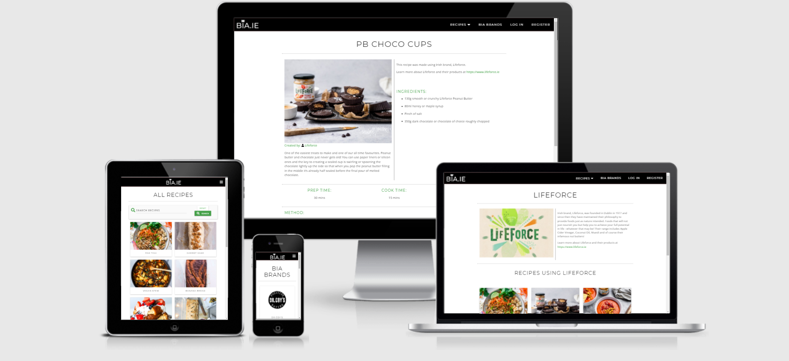
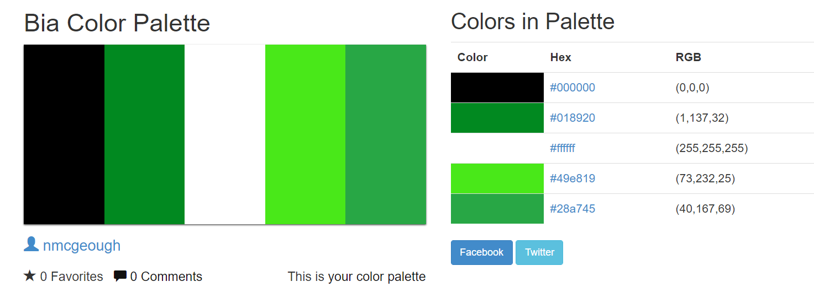

# Bia.ie

## Code Institute MS3 Project in Backend Development 
The brief was to develop a full-stack site that allows users to manage a common dataset about a particular domain. Users make use of the site to share their own data with the community, and benefit from having convenient access to the data provided by all other members. This website is created for educational purposes.
 

# Contents

1. [Project Overview](#project-overview)
2. [UX](#ux)
3. [Features](#features)
4. [Information Architecture](#ia)
5. [Technologies Used](#technologies-used)
6. [Testing](#testing)
7. [Deployment](#deployment)
8. [Credits](#credits)

# Project Overview

## [Bia.ie Online Cookbook](http://bia-ms3.herokuapp.com/)

 

[View website](http://bia-ms3.herokuapp.com/) 
 
[Bia.ie](http://bia-ms3.herokuapp.com/) is an online cookbook and community for Irish food-lovers. For any non-native Irish speakers who may be slightly confused re the website name, 'bia' is Gaeilge for the word 'food'! 

The idea for Bia was conceived in the midst of the Covid 19 Pandemic where many industries became decimated as a result of the virus and life as we once knew it changed forever. 
With the nation ordered to remain socially distanced from one another and stay confined in their homes, people turned to the two things that were constant in this new normal: food and the internet!
Enter the avalanche of tutorials and baking recipes with everyone claiming to hold the ultimate banana bread recipe!
The challenge? To fulfil this new demand for online recipes and create a community around it. Also, to boost the economy by supporting struggling Irish businesses. Bia was the obvious solution. 
Unlike any other online cookbook, the website showcases recipes utilising locally-produced ingredients & products and allows the promotion of these homegrown food producers by displaying ingredients or brands with direct links to their website.
Users of Bia make use of the site by sharing their own recipes with the community, and benefit from having convenient access to recipes provided by all other members all whilst promoting local Irish food businesses.

My own goals as a developer creating this project were to: 
- Develop a web application that allowed users to store and easily access cooking recipes. 
- Create an app which is highly accessibile, responsive and simplistic in design.
- Create the backend code and frontend forms allowing users to add new recipes to the site, view them, edit them and delete them using CRUD operations.
- Create the backend and frontend functionality for users to locate recipes based on the recipe's fields providing full search functionality on the site.
- Provide these search results in a manner that is visually appealing and user-friendly.

[^ Back To Top ](#contents)

# UX

## Goals

### External user’s goal:
- Locate - To easily find inspiration for a future meal or locate a specific recipe based on a past meal or from a personal wishlist. To find recipes from other members by: meal type, by specific ingredients and by dietary requirement. 
- Share - To share knowledge from a homemade recipe or a successful recipe used in the past. To share by adding recipes to the community and providing details by ingredients, cook & prep time, dietary requirements relevant to the recipes and being able to edit and delete them when I no longer want to share with the community.
- Create - To create a list of recipes and store as a customised online cookback to refer back to in the future.

### Site owner's goal:
- Provide a simple, easy to use online cookbook and space where food-lovers can find and share recipes using Irish ingredients with the community. 
- Promote homegrown irish food producers online.
- To benefit from the collection of the recipes in the community to operate as a content incubator for the website.
- Earn revenue through affiliate marketing by directing potential customers towards featured food producers websites. 

### Brand owner's goal:
- Create awareness for the brand on the website.
- Gain potential new customers.
- Show versatility of products by creating recipes on the site.

## User Stories

### External Users

As a new user, I would like to:
- View a visually clean and appealing homepage so that I can instantly understand the purpose of the site and navigate it's offering easily.
- Access the site from any mobile, tablet or desktop devices so that I can have an equally enjoyable experience regardless of the selected device/platform.
- Register a profile easily without the requirement to provide a lot of info so that I can join the community and add my own recipes. 
- View content without requiring to register so that I can quickly locate a specific recipe.
- Browse and filter recipes by meal or dietary category so that I can easily find inspiration for a future meal.
- View a list of recipes by ingredient/meal/dietary keyword search criteria so that I can quickly locate a specific meal/dish.
- View the featured food producers so that I can see any connected recipes that use their products. 
- Learn more about the food producers on the site so that I can support them by purchasing their products.

As a returning user, I would like to:
- Log in and out without encountering issues so that I can have an enjoyable user experience.
- View all the recipes I have stored in a specific area so that I can review my current collection at any time and refer back to them when needed.
- Create a new recipe providing necessary details so that I can share knowledge from a homemade/successful recipe used in the past with the community.
- Edit one of my current recipes so that I can improve the recipe for other members or users.
- Remove one of my current recipes so I that I can choose to no longer share it with the community.
- To have access to all recipes provided by the community so that I can view content from other members.
- To browse recipes from other members so that I can get inspiration for future meals based on meal type, specific ingredients used and by dietary requirement. 

As a brand owner user, I would like to:

- Create recipes to share with the community highlighting products from the brand.
- Get the products in as many places on the website to create awareness for the brand.
- Offer discount to community users to gain potential new customers. 

### Business/Admin Users

As a business/admin user, I would like to do all of the above as well as:

- The ability to edit or remove recipes created by users so that I can vet the content and ensure it's appropriate for users.
- The ability to add, edit or remove recipe categories so that I can keep the categories relevant to what users are searching for
- The ability to add, edit or remove brands as required to maintain relevance between the recipes and brands currently in the community.
- View the amount of clicks from the featured business page and linked ingredient URLs so that I can gauge potential success of affiliate marketing. 

## Design

### Typography
I wanted to use [Montserrat](https://fonts.google.com/specimen/Montserrat#about) for the headings and [Open Sans](https://fonts.google.com/specimen/Open+Sans/#about) as a supporting body font to achieve the desired clean-cut image.

### Icons
Font Awesome icons has been used for this project.

### Color Scheme
The Bia brand monochrome colour scheme was implemented along with pops of green to reflect the Irish fresh products represented throughout the site.
I wanted to keep the color palette simplistic and clean to allow for the imagery from the recipes to stand out and inject the site with colour.
However the colour red is used for error messages for the Signup and Login pages to highlight a warning to the user.

I ended up creating and using the below palette once it had passed rigorous Accessibility testing in **A11y's Color Contrast Accessibility Validator**. 

## Wireframes

The folder contains [Wireframes](wireframes/wireframes.pdf "Bia Wireframes") including mockups of the homepage, an individual recipe page, submit recipe page, featured business page and account creation page designed at the beginning of the project for desktop, tablet and mobile devices. I have also included the projected [sitemap](wireframes/bia-site-map.png "Bia Sitemap") and data [schema](wireframes/schema.PNG "Bia Schema").
**Please note the finalised project contains slight variations to the original wireframes**

[^ Back To Top ](#contents)

# Features

## Existing Features
Existing features
Index page informs the user about the site in the eye-catching jumbotron
 Ads for featured businesses
 Signup
 Login
Search: users are able to search for recipes by username, title or any other text. If no results are found message "No results found. Please try again".
 Sorting by category in navigation links.
 Access to user profile with all users recipes
 If user has not added any recipes, the profile reads "X" and has "Submit Recipe" CTA.
 Whenever user has logged in user is greeted with a 5 second flash welcome message
 When user is first registerd user is greeted with 5 second "Signup Successful" flashed message.
 Profile page displays username in banner
 Thank you page with a "Back Home" button that appears after user has edited or submitted a recipe
 Only registered and logged in users allowed to sumbit/edit and delete recipes.
 Only user that posted the recipe or admin can delete and/or edit it.
 Social icons with links in the page footer
 Recipes displayed in list have title, description, cooking time and user information
 Single recipe page have full recipe information, the date and time it was first created, image and list.
 Single recipe page displays tips only if they have been defined. All other fields are required.
 Submit recipe and edit recipe forms have clear instructions and character limits for certain fields.
 If password is too short or email is invalid etc tooltip appears
 Favicon
 Bootstrap input field validation

## Features Left to Implement
newsletter
Future features
Pagination
Google/Facebook login
 Admin recipe review to either accept or reject recipe for it to be public.
 More categories
 Admin able to add/edit/delete categories
 Sort recipes by tags
 Nutrition calculations
 Server side credential validation
 SSL certificate
 Recipe Comments
 Lazy loading images
 Prevent duplicate subscribers
 "Remember me" signup checkbox
 Edit user profiles
 User profiles with description, avatar, post list
 Ability to click on other user profiles and see recipes they posted
 Page loading animation
 Filter emails so that there are no duplicates for subscription letters
 Admin portal
 Contact form and admin to be able to see all received messages directly in the admin console
 Recipe image url validation

[^ Back To Top ](#contents)

# Information Architecture

[^ Back To Top ](#contents)

## Database Choice
In order to fulfil the project requirements, the NoSQL database MongoDB was utilised to store the data.

This non-relational database structure suits Bia as there are only a few relationships between the various collections. 

## Data Modeling
The project currently relies on five database collections:

#### Categories collection

|**Key**|**Type**|**Notes**|
|:-----|:-----|:-----|
|_id|ObjectId||
|category_name|string||

#### Recipe collection

|**Key**|**Type**|**Notes**|
|:-----|:-----|:-----|
|_id|ObjectId||
|title|string||
|category_name|string||
|recipe_description|string||
|image_url|string||
|serves|Array||
|prep|string||
|cooks|string||
|difficulty|string||
|ingredient_name|string||
|instructions|string||
|date_added|string||
|username|string||

#### Users collection

|**Key**|**Type**|**Notes**|
|:-----|:-----|:-----|
|_id|ObjectId||
|username|string||
|password|string||
|email|string||

#### Businesses collection

|**Key**|**Type**|**Notes**|
|:-----|:-----|:-----|
|_id|ObjectId||
|business_name|string||
|business_description|string||
|business_url|string||

#### Ingredients collection

|**Key**|**Type**|**Notes**|
|:-----|:-----|:-----|
|_id|ObjectId||
|ingredient_name|string||
|business_url|string||

# Technologies Used
## Languages
- [CSS3](https://developer.mozilla.org/en-US/docs/Web/CSS)
- [HTML5](https://developer.mozilla.org/en-US/docs/Web/HTML)
- [Javascript](https://developer.mozilla.org/en-US/docs/Web/JavaScript)
- [Python](https://www.python.org/)
  - [Jinja](https://jinja.palletsprojects.com/en/2.11.x/)

## Libraries and Frameworks

- [Flask](https://palletsprojects.com/p/flask/)
- [jQuery](https://jquery.com/) 
- [Materialize](https://materializecss.com/)

## Extensions and kits

- [Flask](https://pythonhosted.org/Flask)
- [Werkzeug](https://palletsprojects.com/p/werkzeug/)

## Project management & Databases

- [GitHub](https://github.com/)
- [GitPod](https://gitpod.io/)
- [Heroku](https://www.heroku.com/about)
- [MongoDB](https://www.mongodb.com/)

## Tools
- [Autoprefixer](https://autoprefixer.github.io/) to parse my CSS and add vendor prefixes to allow cross-browser compatibility and support.
- [Freeformatter CSS Beautify](https://www.freeformatter.com/css-beautifier.html) to format and automatically indent my CSS file.
- [Freeformatter HTML Formatter](https://www.freeformatter.com/html-formatter.html) to format the HTML in the project.
- [Freeformatter JS Formatter](https://www.freeformatter.com/javascript-beautifier.html) to format the JS file.      
- [Unicorn Revealer Chrome Extension](https://chrome.google.com/webstore/detail/unicorn-revealer/lmlkphhdlngaicolpmaakfmhplagoaln) to inspect and locate where overflow was located in order to simplify the debugging process. 
- [Favicon.io](https://favicon.io//) to generate the favicons for the site.
- [Font Awesome](https://fontawesome.com/) to define signup, login and nav elements by a visual means.
- [Google Fonts](https://fonts.google.com/) to style the website fonts.
- [Figma](https://figma.com) to create the wireframes for the project and customize images for the homepage.
- [Chrome Dev Tools](https://developers.google.com/web/tools/chrome-devtools) to consistently test the site and run reports from Lighthouse.
- [Color Hex](https://www.color-hex.com/) to create the color palette for my project and help structure the UI for the site. 
- [Color Contrast Accessibility Validator](https://color.a11y.com/) to test for colour contrast on the project.
- [W3C Markup Validation Service](https://validator.w3.org/) to check the markup validity of Web documents in HTML.
- [W3C CSS Validation Service](https://jigsaw.w3.org/css-validator/) to check the validity of my CSS in the project.
- [JS Hint Validator](https://jshint.com/) to analyze and ensure the source code complies with coding rules. 
- [Pep8 Online](http://pep8online.com/) to check code for PEP8 requirements in Python
- [WAVE Web Accessibility Evaluation Tool](https://wave.webaim.org/) to check the site for Accessibility compatibility and highlight any potenial issues.
- [Am I Responsive?](http://ami.responsivedesign.is/) to provide a preview of the site across a variety of popular devices.  

[^ Back To Top ](#contents)

# Testing
The Testing process has been documented in this [testing.md file.](/testing.md "testing.md File")

[^ Back To Top ](#contents)

# Deployment

[^ Back To Top ](#contents)

## Local Deployment
## Heroku Deployment

# Credits
I took inspiration from the following sources however I did implement my own custom code with each snippet also:

- I undertook a significant amount of research into backend development in preparation for the project. As well as the Code Institute's walkthrough tutorials by [Tim Nelson](https://github.com/TravelTimN) which provided great guidance for the project, I also watched a significant amount of Youtube tutorials notably [Corey Schafer](https://www.youtube.com/user/schafer5) 

[^ Back To Top ](#contents)

## Code

## Content and Media
The Bia logo and main content for the site was created by myself however brand profile descriptions and recipes as well as their images were obtained from their own websites or Roz Purcell's Natural Born Feeder recipes. 

- Lifeforce brand description & logo - [Lifeforce Website](www.lifeforce.ie)
- Dr Coy's brand description & logo - [Dr Coy's Website](wwww.drcoys.ie)
- Strong Roots brand description & logo - [Strong Roots Website](www.strongroots.com)
- Fulfil brand description & logo - [Fulfil Website](www.fulfilnutrition.com)
- Flahavans brand description & logo - [Flahavans Website](www.flahavans.ie)
- Bunalun Organic brand description & logo - [Bunalun Organic Website](www.nationalorganic.com)

- PB Chocolate Cups recipe & image - [Lifeforce Website](www.lifeforce.ie/recipes/peanut-butter-chocolate-cups)
- No Bake PB Fudge Bars recipe & image - [Lifeforce Website](www.lifeforce.ie/recipes/no-bake-peanut-butter-fudge-bars)
- Muesli Flapjack Bars recipe & image - [Lifeforce Website](www.lifeforce.ie/recipes/muesli-flapjack-bars)
- Red Pepper Soup recipe & image - [Lifeforce Website](www.lifeforce.ie/recipes/roasted-red-pepper-almond-butter-soup)
- Protein Brownies recipe & image - [Natural Born Feeder Website](www.naturalbornfeeder.com/brownies-with-white-chocolate-chunks)
- Cookie Dough Balls recipe & image - [Natural Born Feeder Website](https://wwww.naturalbornfeeder.com/cookie-dough-balls)
- Pad Thai recipe & image - [Natural Born Feeder Website](https://www.naturalbornfeeder.com/peanut-butter-pad-thai-style-noodles)
- Carrot Cake recipe & image - [Natural Born Feeder Website](https://www.naturalbornfeeder.com/carrot-cake)
- Vegan Stew recipe & image - [Natural Born Feeder Website](https://www.naturalbornfeeder.com/irish-vegan-stew)
- French Toast recipe & image - [Natural Born Feeder Website](https://www.naturalbornfeeder.com/french-toast)
- Banana Bread recipe & image - [Natural Born Feeder Website](https://www.naturalbornfeeder.com/marbled-banana-bread)
- Vegan Wellington recipe & image - [Natural Born Feeder Website](https://www.naturalbornfeeder.com/vegan-christmas-wellington-with-strong-roots)

- 404 & 500 pages spilled sugar background image - [Julie Blanner](https://julieblanner.com/wp-content/uploads/2019/10/how-to-make-cinnamon-sugar-2.jpeg)
- About Bia hero image - [Karolina Grabowska at Pexels.com](https://www.pexels.com/photo/different-powdered-spices-on-spoons-on-marble-surface-4198756)
- Homepage Lifeforce featured brand image (manipulated in Figma)- [Lifeforce Website](www.lifeforce.ie)

## Acknowledgements

I would like to thank my fellow student Boris Gersic for his help with testing and of course my mentor Guido Cecilio for his continued support and overall guidance throughout the project. 

[^ Back To Top ](#contents) 

# Disclaimer

If there are any issues with copyright of content, please contact me directly and I will amend as soon as possible. This project is for educational purposes only.

[^ Back To Top ](#contents) 